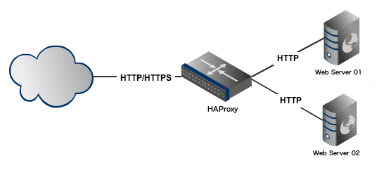
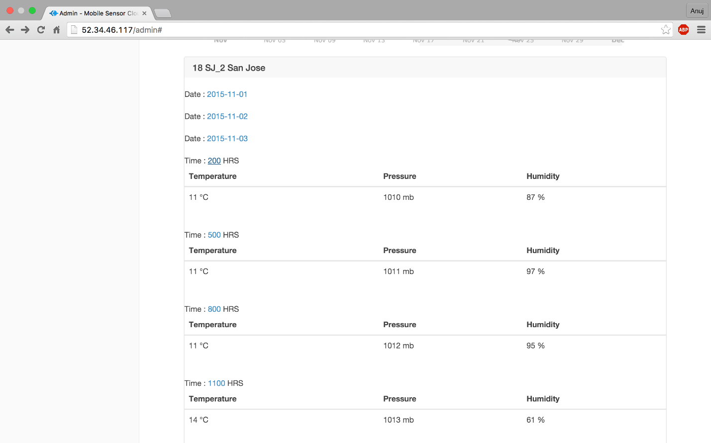
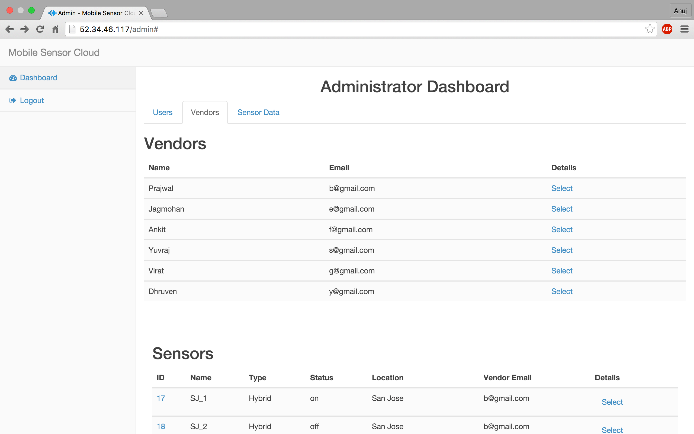
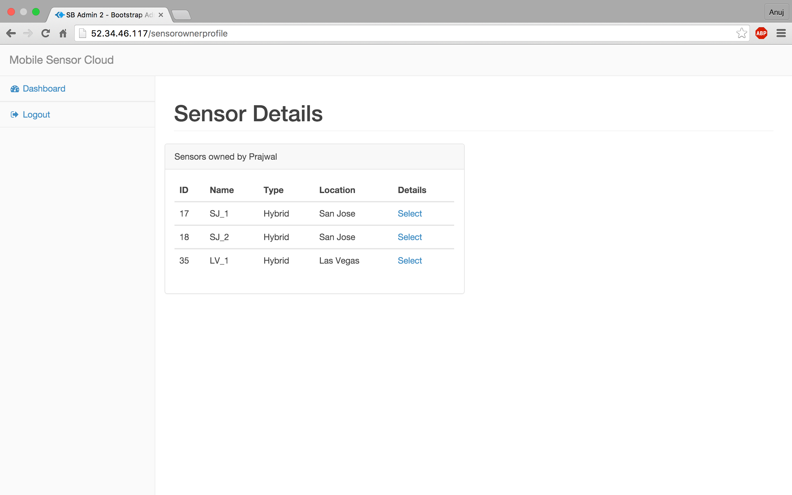
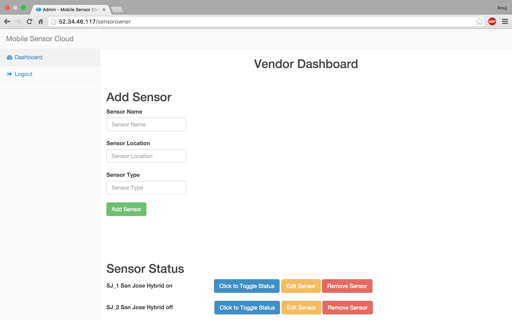

# Mobile Sensor Cloud application

##Project Description
► Cloud application which retrieves weather data from sensors deployed at various locations which can be viewed by a customer 
► Modules: 
&nbsp;&nbsp;&nbsp;&nbsp;&nbsp;&nbsp;-Admin: Monitors the state of all the sensors, sensor vendors and users 
&nbsp;&nbsp;&nbsp;&nbsp;&nbsp;&nbsp;-Sensor Vendor: Has sensors deployed at various location and enrolls in the application 
&nbsp;&nbsp;&nbsp;&nbsp;&nbsp;&nbsp;-Customer: Views the sensor data by enrolling in a tariff. 

##Technology Stack
► BackEnd: Node.js, ExpressJS, RESTful Web Service 
► FrontEnd: AngularJS, BootStrap, amCharts, HTML, CSS 
► Cloud: AWS 
► Load Balancing: HAProxy 
► Database: MySQL, MongoDB 
  

##Architecture

 
###Admin Dashboard

 
###Sensor Data

 
###List Users and Sensors

 
###Sensor Detail

 
###Vendor Dashboard

